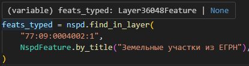
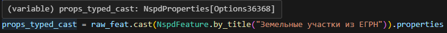

Если вы не знакомы с таким понятием в python, как *"type hints"* (или *"type annotation"*), 
то рекомендуем ознакомиться с ними [в этом уроке из документации FastAPI](https://fastapi.tiangolo.com/it/python-types).

В этой же статье мы покроем те области, которые связаны непосредственно с `pynspd`.

## Приведение к типу в методах

Напомним, что текстовый поиск в `pynspd` имеют две вариации - по теме и по слою:

```python
from pynspd import Nspd, NspdFeature

nspd = Nspd()

# По теме
feat_plain = nspd.find(
    "77:09:0004002:1", 
)

# По модели слоя
feats_typed = nspd.find_in_layer(
    "77:09:0004002:1", 
    NspdFeature.by_title("Земельные участки из ЕГРН"),
)
```

Анализатор IDE сообщает нам о разных типах:




В рантайме типы так же отличаются:

```python
print(type(feat_plain))
#> <class 'pynspd.schemas.feature.NspdFeature'>
print(type(feats_typed))
#> <class 'pynspd.schemas._autogen_features.Layer36048Feature'>
```

`NspdFeature` - это базовая модель слоя НСПД. Она ничего не знает о его свойствах - только обрабатывает сырые данные в Pydantic-модель.

`Layer36048Feature` - модель слоя (в данном случае "Земельные участки"), в котором есть все метаданные.

Ниже приведен краткое сравнение разницы в работе:

|                                                       | `NspdFeature`    | `LayerXXXFeature` |
| ----------------------------------------------------- | :--------------: | :---------------: |
| Доступны все свойства объекта                         | :material-check: | :material-check:  |
| Доступна работа с геометрией `.to_shape()`            | :material-check: | :material-check:  |
| Валидирование данных, приходящих с НСПД               | :material-close: | :material-check:  |
| Подсказки IDE по доступным полям                      | :material-close: | :material-check:  |
| `.model_dump_human_readable()` дает результат         | :material-close: | :material-check:  |


## Приведение к типу постфактум

Иногда у нас нет возможности знать заранее тип объекта, 
поэтому мы используем метод `nspd.find(...)`, который всегда возвращает `NspdFeature`.

При этом может возникнуть потребность в преимуществах модели слоя - например, для экспорта свойств в человекочитаемый словарь, `.model_dump_human_readable()`.

Для этих целей мы можем воспользоваться методом `NspdFeature.cast(...)` и:

- передать в качестве аргумента модель слоя (*статическое приведение*); 
- ничего не передавать и определить модель автоматически (*динамическое приведение*). 

```python
raw_feat: NspdFeature = nspd.find("77:09:0004002:1")

# Статическое приведение
props_typed_cast = raw_feat.cast(
    NspdFeature.by_title("Земельные участки из ЕГРН")
    ).properties

# Динамическое приведение
props_plain_cast = raw_feat.cast().properties
```

Динамически приведенный тип, как подсказывает нам название, не может быть определен статическим анализатором,
поэтому считается базовым классом `NspdProperties[OptionProperties]`:


??? info "Что за `NspdProperties[OptionProperties]`?"
    GeoJSON объекта из НСПД имеет вид:
    ```json
    {
        "type": "Feature",
        "geometry": {...},
        "properties": {
            "category": 1, 
            "category_name": "test",
            ...другие свойства слоя...
            "options": {
                "cad_num": "0:0:0:0",
                ...другие свойства объекта...
            } 
        }
    }
    ```
    Соответственно, `"properties"` - это `NspdProperties`. 

    Т.к. свойства объектов в нем могут быть различными, 
    `NspdProperties` - это *generic*-класс, у которого в квадратных скобках указан тип для `"options"`.

    `OptionProperties` - это базовый класс для `"options"`, в нем нет определений для конкретных типов. 
    Классы для `"options"` с конкретным типом имеют вид `OptionsXXX`

В то время как после статического приведение IDE знает, что это свойства слоя "Земельных участков":



??? info "Что за `Option36368`?"
    Категория слоя "Земельные участки" на НСПД имеет *id=36368*. Отсюда и имя класса свойств этой категории - `Option36368`

Но если мы сравним типы свойств этих двух объектов, то они окажутся одинаковыми:

```python
assert type(props_plain_cast) == type(props_typed_cast)
print(props_plain_cast)
#> <class 'pynspd.schemas.properties.NspdProperties[Options36368]'>
```

Таким образом главное отличие *динамического* и *статического* приведение - **отсутствие подсказки статического анализа**.

!!! tip
    Мы можем приводить тип как всего объекта: `feat.cast().properties.options`, как указано в примерах выше.

    А можем только его свойств: `feat.properties.cast().options` - результат будет идентичен