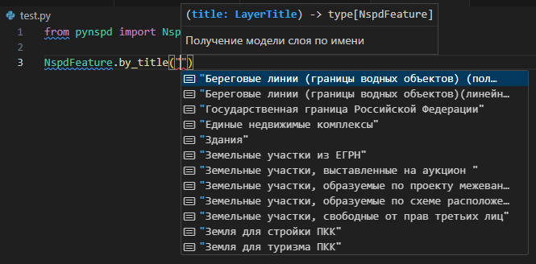
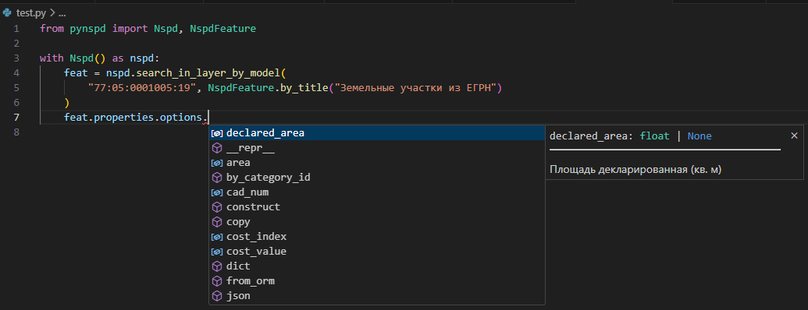
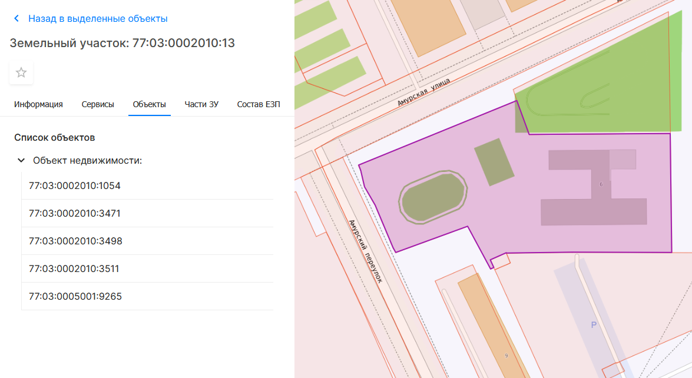

## Создание клиента

Вся работа с API НСПД происходит через объект клиента. Рекомендуется работать с ним через контекстный менеджер:
```python
from pynspd import Nspd

with Nspd() as nspd:
    # Ваш код здесь...
```

Благодаря контекстному менеджеру сессия завершится корректно, очистив все активные подключения.

Другой способ - создать объект клиента и в конце работы завершить сессию напрямую:

```python
from pynspd import Nspd

nspd = Nspd()

try:
    # Ваш код здесь...
finally:
    nspd.close()
```

## Поиск объектов

### По поисковому запросу

НСПД предоставляет два вида поиска объектов - по виду объекта и по слою.

#### По виду объекта

```python
from pynspd import ThemeId

feat = nspd.find("77:05:0001005:19", ThemeId.REAL_ESTATE_OBJECTS)
print(feat.properties.options.land_record_type)
#> Земельный участок
```

#### По слоям

```python
feat = nspd.find_in_layer(
    "77:06:0002007:1014", 
    NspdFeature.by_title("Здания")
)
print(feat.properties.options.floors)
#> 5
```

Если вы работаете в современной **IDE** (*VS Code*, *PyCharm* и т.д.), то она сама подскажет вам доступный список слоев (автоматически или после сочетания клавиш `Ctrl+Пробел`):



Кроме того этот метод приводит ответ от НСПД к статическому типу и мы можем проверить доступные поля: 



Подробнее о типизации ответов читайте в [этой статье](advanced/typing.md).

??? info "Немного подробнее про фильтрацию в `.find`"
    `.find` не просто выдает оригинальную поисковую выдачу из НСПД, а гарантирует, 
    что запросу соответствует только один результат. 
    В это входит как и простая распаковка массива с одним результатом, так и более комплексные проверки. 

    Если быть точнее: что поисковой запрос действительно присутствует в ответе и 
    НСПД не галлюцинирует (например, запрос `77:1:3033:1031` возвращает данные по к/н `02:54:000000:81`),
    а так же напрямую относится к объекту (например, исключает помещения, включенные в ответ по зданию)

#### Поиск по адресу

Если вам нужно получить поисковую выдачу, аналогичную НСПД (например, для поиска по адресу), 
методы `.find` вам могут не подойти из-за их строгой фильтрации. Вместо этого воспользуйтесь метод `.search(...)`:

```python
feats = nspd.search('Москва Новочерёмушкинская улица 24 корпус 1')
print(feats)
#> [ NspdFeature<Здания: 77:06:0004001:1042>,
#>  NspdFeature<Помещения: 77:06:0002011:1040>,
#>  NspdFeature<Помещения: 77:06:0002013:1204>,, ...]
```

Как и в предыдущих примерах, вы можете уточнить слой для поиска:

```python
feats = nspd.search_in_layer(
    'Москва Новочерёмушкинская улица 24 корпус 1',
    NspdFeature.by_title("Здания")
)
print(feats)
#> [NspdFeature<Здания: 77:06:0004001:1042>]
```

!!! warning "Форматируйте адрес перед запросом"
    НСПД довольно строг к формату адреса, поэтому пробуйте разное написание, если первоначальный не дал результат:

    `Москва Новочер{--е--}мушкинская ул. 24` ->  `Москва Новочер{++ё++}мушкинская ул. 24`

    `Москва Бориса Галушкина ул. 14 {--к.--} 1` ->  `Москва Бориса Галушкина ул. 14 {++корпус++} 1`

    `Москва {--9-я--} Рота ул. 15` ->  `Москва {++Девятая++} Рота ул. 15`

### В точке

```python
from shapely import Point

layer_def = NspdFeature.by_title("Земельные участки из ЕГРН")
feats = nspd.search_at_point(Point(37.546440653, 55.787139958), layer_def)

print(feats[0].properties.options.cad_num)
#> "77:09:0005008:11446"
```

!!! tip
    Если вы не хотите использовать `shapely.Point`, вы можете использовать метод `.search_at_coords(lat, lng, layer_def)`.
    Обратите внимание, что в географических координатах сначала идет широта, т.е. `lat`=`y`

Аналогично поиску по слою, ответ будет приведен к статическому типу.

### В контуре

```python
from shapely import from_wkt

contour = from_wkt(
    "Polygon ((37.62381 55.75345, 37.62577 55.75390, 37.62448 55.75278, 37.62381 55.75345))"
)

feats = nspd.search_in_contour(
    contour,
    NspdFeature.by_title("Земельные участки из ЕГРН"),
)
cns = [i.properties.options.cad_num for i in feats]
print(cns)
#> ["77:01:0001011:8", "77:01:0001011:14", "77:01:0001011:16"]
```

Аналогично поиску по слою, ответ будет приведен к статическому типу.

## Работа с геометрией

Исходный формат ответов по объекту от НСПД - [GeoJSON](https://ru.wikipedia.org/wiki/GeoJSON). 

!!! info "Системы коодинат"
    Несмотря на то, что НСПД может в разных ситуациях ответить в разных системах координат, `pynspd` ^^всегда^^ приводит систему коодинат геометрии в EPSG:4326.

    По этой же причине все методы, работающие с геометрией, ожидают, что она будет в СК EPSG:4326.

Однако, если нам необходимо производить геометрические операции, он не совсем подходит. Поэтому `pynspd` предоставляет возможность конвертировать геометрию в формат [shapely](https://shapely.readthedocs.io/en/2.0.4/manual.html):

```python
feat.geometry.to_shape()
```

Или же сразу в мультигеометрию (что может быть удобно для сохранения в базу данных, вроде [PostGIS](https://postgis.net/)):

```python
feat.geometry.to_multi_shape()
```

!!! warning "Участки без координат границ"
    Попытка приведения объекта без координат границ к мультитипу приведет к ошибке. Вы можете заранее проверить наличие координат по свойству `feat.properties.options.no_coords`


## Работа со свойствами

Свойства объекта лежат в свойстве `.properties`:

```python
feat = nspd.search_in_layer(
    '63:01:0810003:510', 
    NspdFeature.by_title("Земельные участки из ЕГРН")
)

print(feat.properties.model_dump().keys())
#> ['category',
#>  'category_name',
#>  'options',
#>  'system_info',
#>  ...]
```

!!! info "Что за `.model_dump()`?"
    Все результаты `pynspd` является [pydantic](https://docs.pydantic.dev/latest)-моделями. 
    Фактически это значит, что `pynspd` возвращает [дата-класс](https://docs.python.org/3/library/dataclasses.html), 
    прошедший предварительную валидацию. 
    Для конвертации `pydantic`-модели в словарь используется метод `.model_dump()`

Как можно заметить, здесь нет информации о самом объекте - дело в том, что НСПД передает ее во вложенном поле `.options`

```python
print(feat.properties.options.model_dump().keys())
#> ['cad_num',
#>  'readable_address',
#>  'specified_area',
#>  'declared_area',
#>  'cost_value',
#>  ...]
```

Также вы можете сразу получить словарь с названиями из карточки НСПД:

```python
print(feat.properties.cast().options.model_dump_human_readable().keys())
#> ['Кадастровый номер',
#>  'Адрес',
#>  'Площадь уточненная (кв. м)',
#>  'Площадь декларированная (кв. м)',
#>  'Площадь (кв. м)',
#>  'Кадастровая стоимость (руб.)',
#>  ...]
```

!!! info "Приведение типа объекта"
    Если вас заинтересовало, почему используется метод `.cast()`, 
    вы можете узнать об этом в статье ["Типизация ответов"](advanced/typing.md)

## Получении информации из вкладок

Часть информации об объекте доступна только в отдельных вкладках:



Для получения этой информации при помощи `pynspd`, нужно:

1. Получить объект любым вышеописанным способом;
2. Вызвать метод `nspd.get_tab_data(feat, tab_name)`, где:
- `feat` - объект из пункта 1;
- `tab_name` - имя вкладки с НСПД (как и с именем слоя, будет доступна подсказка от IDE)

Вы также можете вызвать метод для сбора данных со вкладки напрямую, не передавая имя вкладки:

- `nspd.tab_land_parts(...)` - Части ЗУ
- `nspd.tab_land_links(...)` - Связанные ЗУ
- `nspd.tab_permission_type(...)` - Виды разрешенного использования
- `nspd.tab_composition_land(...)` - Состав ЕЗП
- `nspd.tab_build_parts(...)` - Части ОКС
- `nspd.tab_objects_list(...)` - Объекты