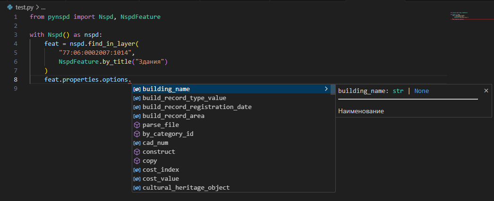

## Создание клиента

Вся работа с API НСПД происходит через объект клиента. Работа с ними возможна как в контекстном менеджере:
```python
from pynspd import Nspd

with Nspd() as nspd:
    # Ваш код здесь...
```

Либо же мы можем создать объект клиента без контекстного менеджера, но не забудьте потом завершить его сессию:

```python
from pynspd import Nspd

nspd = Nspd()

# Ваш код здесь...

nspd.close()
```

О том, почему важно закрывать сессию, вы можете прочитать в документации [httpx](https://www.python-httpx.org/advanced/clients/#usage) - замечательной библиотеке для http-запросов, которую `pynspd` использует под капотом.

## Поиск объектов

### По поисковому запросу

НСПД предоставляет два вида поиска объектов - по виду объекта и по слою.

#### По виду объекта

```python
from pynspd import ThemeId

feat = nspd.search_in_theme("77:05:0001005:19", ThemeId.REAL_ESTATE_OBJECTS)
print(feat.properties.options.land_record_type)
#> Земельный участок
```

#### По слоям

Для более точного поиска мы можем указать id конкретных слоев для поиска, подсмотрев их в запросах НСПД:

```python
feat = nspd.search_in_layer("77:05:0001005:19", 36048) # id земельных участков
```

Разумеется, не очень удобно каждый раз подглядывать в запросы НСПД. Здесь нам приходит на помощь собранная с НСПД информация о слоях:

```python
feat = nspd.search_in_layer_by_model(
    "77:05:0001005:19", 
    NspdFeature.by_title("Земельные участки из ЕГРН")
)
```

Если вы работаете в современной **IDE** (*VS Code*, *PyCharm* и т.д.), то она сама подскажет вам доступный список слоев:


Метод `.search_in_layer_by_model(...)` удобен не только тем, что нам не нужно прописывать id слоя, 
но и тем что он может привести ответ НСПД к статическому типу: 



Подробнее о типизации ответов читайте в статье ["Типизация ответов"](advanced/typing.md)


### В точке

Аналогично поиску по запросу, мы можем либо указать id слоя, либо сразу передать модель слоя:

```python
from shapely import Point

# по id слоя
feats = nspd.search_at_point(Point(37.546440653, 55.787139958), 36048)

# по модели слоя
feats = nspd.search_at_point_by_model(    
    Point(37.546440653, 55.787139958), 
    NspdFeature.by_title("Земельные участки из ЕГРН"),
)
print(feats[0].properties.options.cad_num)
#> "77:09:0005008:11446"
```

### В контуре

Аналогично поиску по запросу, мы можем либо указать id категории свойств, либо сразу передать модель слоя:

```python
from shapely import wkt

contour = wkt.loads(
    "Polygon ((37.62381 55.75345, 37.62577 55.75390, 37.62448 55.75278, 37.62381 55.75345))"
)

# по id категории
feats = nspd.search_in_contour(contour, 36368)

# по модели слоя
feats = nspd.search_in_contour_by_model(
    contour,
    NspdFeature.by_title("Земельные участки из ЕГРН"),
)
cns = [i.properties.options.cad_num for i in feats]
print(cns)
#> ["77:01:0001011:8", "77:01:0001011:14", "77:01:0001011:16"]
```

## Работа с геометрией

Исходный формат ответов по объекту от НСПД - [GeoJSON](https://ru.wikipedia.org/wiki/GeoJSON). 

!!! info "Системы коодинат"
    Несмотря на то, что НСПД может в разных ситуациях ответить в разных системах координат, `pynspd` ВСЕГДА приводит систему коодинат геометрии в EPSG:4326

Однако, если нам необходимо производить геометрические операции, он не совсем подходит. Поэтому `pynspd` предоставляет возможность конвертировать геометрию в формат [shapely](https://shapely.readthedocs.io/en/2.0.4/manual.html):

```python
feat.geometry.to_shape()
```

Или же сразу в мультигеометрию (что удобно для баз данных, вроде [PostGIS](https://postgis.net/)):

```python
feat.geometry.to_multi_shape()
```

!!! warning "Участки без координат границ"
    Попытка приведения объекта без координат границ к мультитипу приведет к ошибке. Вы можете заранее проверить наличие координат по свойству `feat.properties.options.no_coords`


## Работа со свойствами

Свойства объекта лежат в свойстве `.properties`:

```python
feat = nspd.search_in_layer_by_model(
    '63:01:0810003:510', 
    NspdFeature.by_title("Земельные участки из ЕГРН")
)

print(feat.properties.model_dump().keys())
#> ['category',
#>  'category_name',
#>  'options',
#>  'system_info',
#>  ...]
```

!!! info "Что за `.model_dump()`?"
    Все результаты `pynspd` является [pydantic](https://docs.pydantic.dev/latest)-моделями. 
    Фактически это значит, что `pynspd` отдает вам [датакласс](https://docs.python.org/3/library/dataclasses.html), 
    прошедший предварительную валидацию. 
    Для конвертации `pydantic`-модели в словарь используется метод `.model_dump()`

Как можно заметить, здесь нет информации о самом объекте - дело в том, что НСПД передает ее во вложенном поле `.options`

```python
print(feat.properties.options.model_dump().keys())
#> ['cad_num',
#>  'readable_address',
#>  'specified_area',
#>  'declared_area',
#>  'cost_value',
#>  ...]
```

Так же вы можете сразу получить словарь с названиями из карточки НСПД:

```python
print(feat.properties.cast().options.model_dump_human_readable().keys())
#> ['Кадастровый номер',
#>  'Адрес',
#>  'Площадь уточненная (кв. м)',
#>  'Площадь декларированная (кв. м)',
#>  'Площадь (кв. м)',
#>  'Кадастровая стоимость (руб.)',
#>  ...]
```

!!! info "Приведение типа объекта"
    Если вас заинтересовало, почему используется метод `.cast()`, 
    вы можете узнать об этом в статье ["Типизация ответов"](advanced/typing.md)

## Получении информации из вкладок

Часть информации об объекте доступна только в отдельных вкладках:


Для получения этой информации при помощи `pynspd`, нужно:

1. Получить объект любым вышеописанным способом;
2. Вызвать нижеперечисленный метод, передав в него объект.

Перечень существующих методов API для получения данных из вкладок:

- `nspd.tab_land_parts(...)` - Части ЗУ
- `nspd.tab_land_links(...)` - Связанные ЗУ
- `nspd.tab_permission_type(...)` - Виды разрешенного использования
- `nspd.tab_composition_land(...)` - Состав ЕЗП
- `nspd.tab_build_parts(...)` - Части ОКС
- `nspd.tab_objects_list(...)` - Объекты